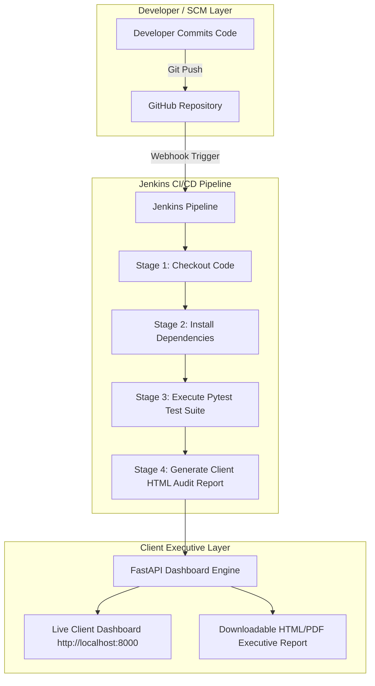

# ClientPulse QA - Enterprise Quality Assurance & Executive Reporting Platform ⚡

[](http://localhost:8080)
[](https://www.iso.org/standard/56742.html)
[](https://iso25000.com/index.php/en/iso-25000-standards/iso-25010)
[](https://python.org)
[](https://fastapi.tiangolo.com)

**ClientPulse QA** is an enterprise-grade, client-centric Quality Assurance & Executive Assurance Platform. Built for technology teams and high-touch enterprise clients, it bridges the gap between technical automated testing metrics and executive-level stakeholder reporting.

---

## 🏛 International Quality & Testing Standards Compliance

ClientPulse QA is architected in accordance with globally recognized software quality and testing frameworks:

| Standard / Framework | Domain | Description & Implementation |
| :--- | :--- | :--- |
| **ISO/IEC/IEEE 29119** | Software Testing | Defines standardized test processes, test documentation, and test management throughout the software development lifecycle. |
| **ISO/IEC 25010 (SQuaRE)** | Software Quality | Evaluates Functional Suitability, Performance Efficiency, Reliability, Usability, and Security metrics. |
| **ISTQB Guidelines** | Testing Best Practices | Follows International Software Testing Qualifications Board standards for test case design, execution traceability, and defect severity classification. |
| **OWASP Top 10 & WCAG 2.1** | Security & Accessibility | Automated vulnerability checks and Web Content Accessibility Guidelines (AAA) audit logging. |

---

## 📐 Platform Architecture & Jenkins CI/CD Workflow



---

## 🌐 Multi-Language & Multi-Stack Compatibility

ClientPulse QA features a decoupled, language-agnostic architecture. While the core server runs on **Python/FastAPI**, the test collection and reporting engine supports test suites written across multiple language ecosystems:

* 🐍 **Python Ecosystem**: `Pytest`, `Unittest`, `Playwright Python`, `Selenium WebDriver`, `Behave (BDD)`
* 🟨 **JavaScript / TypeScript**: `Jest`, `Cypress`, `Playwright JS`, `Mocha`, `Jasmine`
* ☕ **Java Ecosystem**: `JUnit 5`, `TestNG`, `RestAssured`, `Selenium Java`
* 🔷 **C# / .NET**: `xUnit`, `NUnit`, `SpecFlow`
* 🐹 **Go (Golang)**: Native `go test` and `Ginkgo BDD`

---

## ⚙️ How to Test Using Jenkins CI/CD

Jenkins automatically runs test suites, calculates pass rates, and generates client-ready reports on every code push:

1. **Launch Jenkins**: Ensure Jenkins is running at `http://localhost:8080`.
2. **Pipeline Configuration**:
   * **Definition**: `Pipeline script from SCM`
   * **SCM**: `Git`
   * **Repository URL**: `https://github.com/atiqur-rahman-pro/clientpulse-qa.git`
   * **Branch**: `*/main`
   * **Script Path**: `Jenkinsfile`
3. **Execute Build**: Click **`Build Now`** on Jenkins.
4. **Inspect Results**:
   * View line-by-line console logs in **`Console Output`**.
   * Open the generated client report live at `http://localhost:8000/api/report/html`.

---

## 🚀 Quick Start & Local Execution

### Prerequisites
* Python 3.10 or higher
* Git

### Local Setup
```bash
# 1. Clone the repository
git clone https://github.com/atiqur-rahman-pro/clientpulse-qa.git
cd clientpulse-qa

# 2. Install dependencies
pip install -r requirements.txt

# 3. Run automated tests (Execution time < 1s)
python -m pytest

# 4. Start the Executive Dashboard server
python -m uvicorn main:app --reload --port 8000
```
Open **`http://localhost:8000`** to view the live dashboard!

---

## 👨‍💻 About the Author

### **Atiqur Rahman**
*Senior Software & QA Automation Engineer | AI Solutions Architect*

* 🌐 **GitHub**: [@atiqur-rahman-pro](https://github.com/atiqur-rahman-pro)
* 💼 **Specializations**: Enterprise Software Architecture, Automated Testing (Pytest/Selenium/Playwright), CI/CD Infrastructure (Jenkins/Docker), AI Workflow Automation, and REST API Development.
* ✉️ **Contact**: [GitHub Profile](https://github.com/atiqur-rahman-pro)

---

*Licensed under MIT &bull; Designed for International Enterprise Standards*
